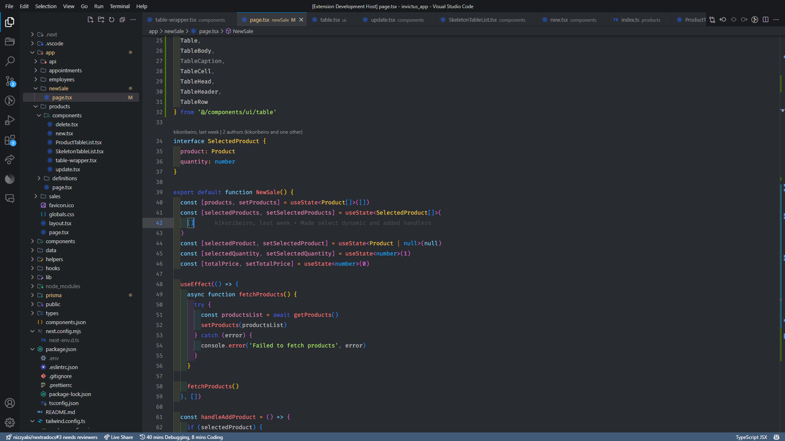
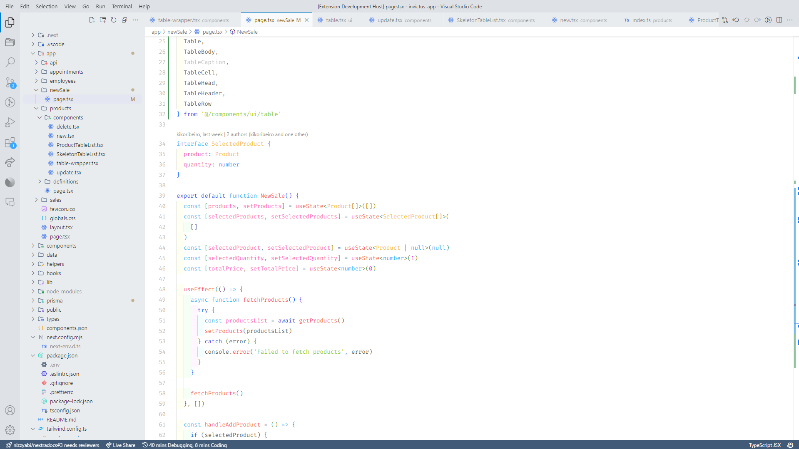

# Ashen Theme

Ashen is a sleek, dark gray theme designed with readability and eye comfort in mind. Featuring a balanced color palette, it ensures that syntax highlighting is clear and easy to read, reducing strain during long coding sessions. The theme's soft contrasts and soothing tones create a visually pleasing environment that enhances focus and minimizes fatigue. Ideal for developers who value both style and comfort, Ashen makes coding a more enjoyable and productive experience.

## Inspiration

This theme was firstly inspired by Discord's dark theme colors, and then i decided to make my own syntax highlighting, with focus on readability and prevent eye strain from coding too long.

## Theme Preview

## Additional Information

This theme was created by [dpaulos6](https://github.com/dpaulos6/) and you can check all my extensions [here](https://marketplace.visualstudio.com/publishers/dpaulos6/).
